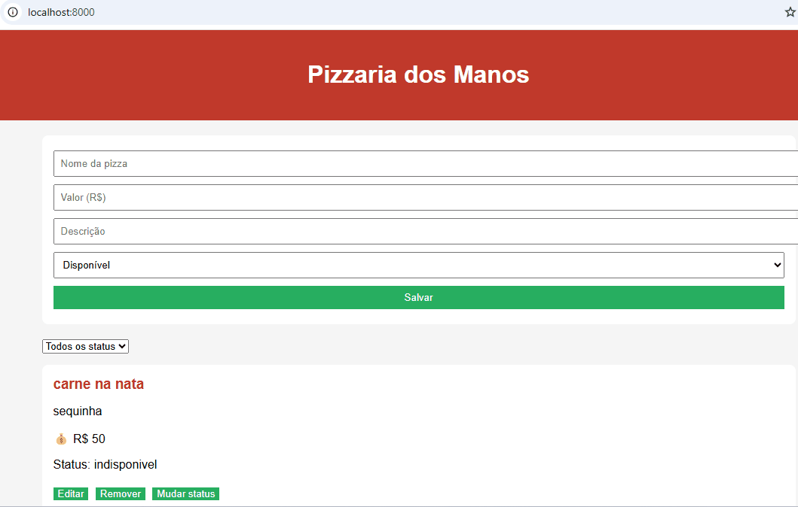

# PIZZARIA DOS MANOS

Este projeto é uma aplicação **Full Stack** para gerenciar um **cardápio de pizzas**, permitindo cadastrar, listar, editar, remover e alterar o status das pizzas.

- **Backend:** API REST em Flask  
- **Frontend:** Interface web consumindo a API via `fetch`  
- **Persistência:** Arquivo JSON (`pizzas.json`)  

---

## Tecnologias Utilizadas

- Python 3  
- Flask  
- Flask-CORS  
- HTML, CSS (Tailwind)  
- JavaScript (Fetch API)  

---

## Como rodar o Backend

### 1. Abra um terminal
- PowerShell ou CMD


### 2. Navegue até a pasta do backend:

```bash
cd d:\Users\COMPUTER\Documents\PROJETO---API-4-B\backend
```

### 3. (Opcional, mas recomendado) Crie e ative um ambiente virtual:

```bash
python -m venv .venv
.venv\Scripts\activate
```

### 4. Instalar dependências
No diretório do backend, execute:

```bash
pip install flask flask-cors
```

### 5.Inicie o servidor Flask:
```bash
python app.py
```
Você verá um aviso dizendo que o servidor está rodando em http://127.0.0.1:5000.

## Como rodar o frontend

### 1. Abra outro terminal
- PowerShell ou CMD


### 2. Navegue até a pasta do frontend:

```bash
cd d:\Users\COMPUTER\Documents\PROJETO---API-4-B\frontend
```

### 3. Vamos usar o Python para servir os arquivos HTML (simular um servidor web simples):

```bash
python -m http.server 8000
```
Isso iniciará um servidor para o frontend na porta 8000

### Acessar
 - 1. Abra seu navegador (Chrome, Edge, Firefox).
 - 2. Acesse: http://localhost:8000

## API Endpoints
endpoints da API

### GET PIZZAS
```bash
GET /pizzas - Lista todas as pizzas cadastradas.
```

```bash
[
    {
        "id": 1,
        "nome": "carne na nata",
        "descricao": "sequinha",
        "valor": 50,
        "status": "disponivel"
    },
    {
        "id": 2,
        "nome": "carne de boi",
        "descricao": "boazinha",
        "valor": 35,
        "status": "disponivel"
    },
    {
        "id": 3,
        "nome": "carne de porco",
        "descricao": "chiqueiro",
        "valor": 20,
        "status": "promocao"
    }
]
```

### POST PIZZAS

```bash
POST /pizzas - Cadastra uma nova pizza
```
- request
```bash
[
    {
        "nome": "carne de porco",
        "descricao": "chiqueiro",
        "valor": 20,
        "status": "promocao"
    }
]
```
- response
```bash
[
    {
        "id": 3,
        "nome": "carne de porco",
        "descricao": "chiqueiro",
        "valor": 20,
        "status": "promocao"
    }
]
```


### PUT /pizzas/:id
```bash
PATCH /pizzas/:id/status - Atualiza nome, descricao e valor de uma pizza pelo ID.
```
- request
```bash
[
    {
        "nome": "carne de ave",
        "descricao": "frango voador",
        "valor": 60,
    }
]
```
- response
```bash
[
    {
        "id":3
        "nome": "carne de ave",
        "descricao": "frango voador",
        "valor": 60,
        "status": "promocao"
    }
]
```

### PATCH /pizzas/:id/status
```bash
PATCH /pizzas/:id/status - Altera apenas o status da pizza.
```
- request
```bash
{
  "status": "indisponivel"
}
```

- response
```bash
[
    {
        "id":3
        "nome": "carne de ave",
        "descricao": "frango voador",
        "valor": 60,
        "status": "indisponivel"
    }
]
```

### DELETE /pizzas/:id
```bash
DELETE /pizzas/:id - Remove uma pizza do cardápio.
```
- response
```bash
{
  "mensagem": "Pizza removida!"
}
```

## Regras de Validação

Ao cadastrar ou editar uma pizza, o backend valida os dados enviados. As regras são:

- **Nome**
  - Obrigatório
  - Deve ter **no mínimo 3 caracteres**

- **Descrição**
  - Obrigatória

- **Valor**
  - Deve ser numérico
  - Deve ser **maior que zero**

- **Status**
  - Deve ser um dos valores permitidos:
    - `disponivel`
    - `indisponivel`
    - `promocao`

> Todos os erros de validação retornam **HTTP 400** com uma mensagem clara em JSON.

### Exemplos de erros retornados

1. **Nome inválido ou vazio:**
```bash
{
  "erro": "Nome deve ter no mínimo 3 caracteres"
}
```

2. **Descrição vazia**
```bash
{
  "erro": "Descrição é obrigatória"
}

```
3. **Valor inválido:**
```bash
{
  "erro": "Valor deve ser maior que zero"
}
```

4. **Status inválido:**
```bash
{
  "erro": "Status inválido",
  "status_validos": '["disponivel", "indisponivel", "promocao"]'
}
```
## Demonstração do Sistema



## Contribuidores 🍕